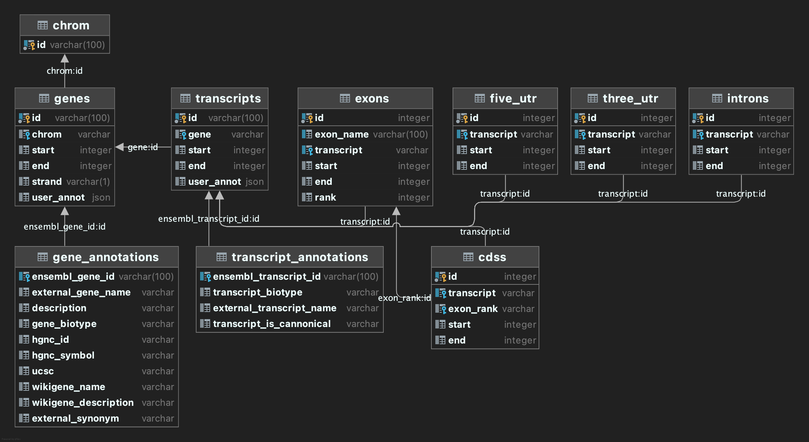

# python version of txdb database

This is my humble attempt to create something similar to R's GenomicFeatures library. I'm trying to create a sqlite database for low memory footprint given a gtf. 
The database contains several tables that map genomic features. I'm also querying biomart for additional columns for gene and transcript level annotations. 

The user can specify as many biomart columns as needed but keep in mind that things might time out or take a long time. So get only the things you think you might need. 
You also need to specify what kind of columns these are. I've added an `attrs.txt` file that contains the columns available at time (ensembl v 107). See the `config.yaml` file
for an example. You can add/remove from it or change it completely it's up to you. 

## Creating the database

```
python3 create_database.py  -g {path to gtf} -y {path to config.yaml}
```

This creates a sqlite database with the following schema:



Keep in mind that the columns in the gene_annotations table will be dynamically created so yours might be different. 

## Querying the databse

After creating the database you would need to create a genome object

```python
from sqlalchemy import create_engine
import pybiomart as biomart
from pytxdb import *


db=create_engine("sqlite:///genome.db")
mart=biomart.Dataset(name={ensembl_name},
                    host={ensembl_url})
fasta="fasta_file_path" # chromosome names must match the gtf and be indexed
genome=Genome(db, fasta, mart)
```

There are several methods for getting different sequences these are

```python
Genome.genes()
Genome.transcript()
Genome.exons()
Genome.introns()
Genome.three_utr()
Genome.five_utr()
Genome.cds()
```

For genes (transcripts) you can specify gene (gene or transcript) names to return coordinates for
those only. The names needs to be a list even if you have only one thing. 

For other methods you can specify gene or transcript names but also need to tell whether you are 
looking for a gene or a transcript using the `level` argument. 

You can search for ensembl ids with the `search_gene` method. You can search all fields or specify a column. 
This can be exact text or regex if `regex` parameter is set to `True` by default. 

Each of the genomic feature queries (genes, exons etc.) either returns a pandas `DataFrame` or pyranges
`pyranges`. The latter can be used to return sequences from the fasta file using the `get_sequence` function. 
The returned sequences will be strand specific and biopython `Seq` object, if you provide more than 
one item in the genomic ranges you have the option to concat them (like coding sequences of a transcript to get the whole thing). 
You can also return amino acid sequences. 

I will implement a feature to translate starting from the first `AUG` in a later version. Currently, you cannot specify 
an alternative codon table but I do not see a reason for it at the moment, if you need to use an alternate mapping you can 
set the dna sequence and use `bio.Seq()` methods.  

Additionally, if you specify a pyranges object and a transcript name you can search for protein domains 
that match to that region. You will need a biomart connection and a valid query name like `pfam` using the
`domains` function. 

Finally, you can add arbitrary `dict` annotations to each gene or transcript these are stored as `JSON` in the
sqlite table but there isn't really a way to search them yet. That will be in the next release. 

Please let me know if there are any issues in the issues section 

In the next release I'm planning to add support for MySQL, PostgreSQL and MariaDB support which you can specify with an
.env file. 